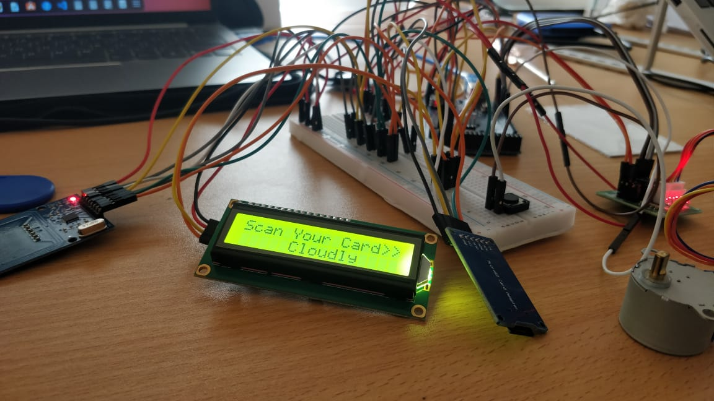

# Automatic Entry System

The **Automatic Entry System** is an embedded project designed to control access to a restricted area. It uses an Arduino Mega with a non-blocking state machine, RFID module, SD card storage, and other components to track employee access, log working hours, and maintain admin and user functionalities. 

## Table of Contents

1. [Project Overview](#project-overview)
2. [Installation](#installation)
3. [Components](#components)
4. [System Architecture](#system-architecture)
5. [Functionality](#functionality)
   - [Admin Functions](#admin-functions)
   - [User Functions](#user-functions)
6. [State Machine Design](#state-machine-design)
7. [References](#references)

---

## Project Overview

This project provides an automated entry system using an Arduino Mega, configured with I2C/SPI for master-slave communication. The system operates in a non-blocking state machine paradigm to ensure responsive handling of parallel tasks. The system supports two roles:

- **Admin:** Manages employee records, access logs, and other administrative functions through a terminal.
- **User:** Logs in using RFID, records working hours, and controls entry via an automated door.

---

## Installation

1. **Install PlatformIO and Arduino IDE**: Follow these links to install the necessary tools:
   - [PlatformIO](https://platformio.org/install)
   - [Arduino IDE](https://www.arduino.cc/en/software)
   
2. **Troubleshoot Arduino Mega Connection Issues**: If your Arduino Mega is not recognized, refer to this [Arduino Forum Thread](https://forum.arduino.cc/t/arduino-not-recognized/1129130/6) for solutions.

---

## Components

- **Arduino Mega** (Master Board)
- **Stepper Motor** (for door control)
- **Real-Time Clock (RTC)** (for time tracking)
- **SD Card Module** (for logging data)
- **RFID Module** (for user identification)
- **Button** (for manual door operation)

---

## System Architecture

The system is organized as a single-board solution using I2C and SPI communication for modularity. Each peripheral is connected as follows:

- **Stepper Motor**: Controls door movement.
- **RTC Module**: Tracks the date and time of user entries.
- **SD Card Module**: Stores logs of RFID scans and user actions.
- **RFID Module**: Reads user RFID tags to identify employees.

The architecture uses a **non-blocking state machine** to handle real-time events efficiently, enabling parallel functionality for admin and user operations.

---

## Functionality

### Admin Functions

Admins have access to a variety of functions through the terminal interface, allowing them to manage employee data and system logs. Admin capabilities include:

- **View Employees**: List all registered employees.
- **View RFID Logs**: Display a record of RFID scans.
- **Manage Admins**: List or add/remove other admins.
- **Delete Employee**: Remove a user based on employee ID.
- **View Working Hours**: Retrieve working hours from RFID logs.
- **Add Employee**: Register a new employee to the system.

### User Functions

Users can interact with the system using RFID to log entry/exit actions. Key functions for users include:

- **RFID Login**: Scan RFID to log entry or exit.
- **Log Working Hours**: Automatically log time in the system upon RFID scan.
- **Door Control**: Automatically open the door if the RFID tag is recognized, or use the manual button to open or close the door.

---

## State Machine Design

The system follows a **non-blocking state machine** paradigm, allowing efficient handling of multiple tasks without delays. 

### Non-Blocking State Machine

In a typical scenario, when a user scans their RFID:

1. **RFID Detection**: The system detects the RFID scan, triggering a lookup in the database.
2. **User Validation**: If the RFID tag matches a registered employee, the system transitions to the door control state.
3. **Door Control**: The stepper motor activates, opening the door if the user is authorized.
4. **Logging**: The system logs the entry in the SD card with a timestamp from the RTC.

This process is non-blocking, allowing the system to handle new inputs (e.g., another RFID scan or admin command) without waiting for the door cycle to complete.

---

## References

- [PlatformIO Installation Guide](https://platformio.org/install)
- [Arduino IDE Installation Guide](https://www.arduino.cc/en/software)
- [Arduino Mega Troubleshooting Guide](https://forum.arduino.cc/t/arduino-not-recognized/1129130/6)

---

## Media

### Videos and Images

- **[Accept.mp4](docs/Accept.mp4)**: Demonstrates successful RFID scan and door entry.
- **[Denied.mp4](docs/Denied.mp4)**: Demonstrates unauthorized RFID scan attempt.
- ****: Shows the hardware setup for the project.

---

## Coding Style

The project follows the **Barr-C Coding Style** for consistency and readability.

---
